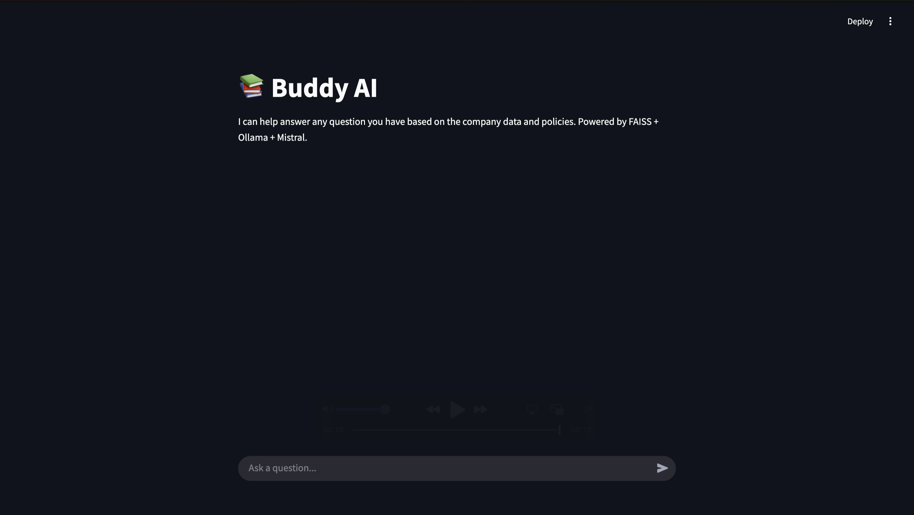

# 🧠 Buddy AI – Private Document Assistant with LLM

Buddy AI is an AI-powered assistant that enables employees to query departmental (HR, Legal, IT, Compliance, etc) policies/documents.

✅ **Purpose:**
  - Reduce employee query resolution time from 3-5 days to immediately
  - Improve knowledge base accesibility
  - Reduce dependency
  - Instead of manually scanning PDFs / Word docs, uses RAG-based AI to deliver direct answers from internal documents (PDFs, Word, JSON, XML)
    
-----

### 🎥 App Walkthrough (Click on image or Link below)

  
    
  <b>OR</b>
    

**[Demo Link](https://github.com/Devarsh26/rag-app/releases/tag/v1_app)**

-----

### ⚙️ System Architecture & Working

1. Documents from SharePoint (PDF/Word/JSON/XML)
2. Kafka + PySpark stream structured/unstructured data
3. Files stored in SQLite
4. Chunking - Embedding - VectorDB
   - Text is chunked (LangChain's SemanticChunker)
   - Embedded (HuggingFace's sentence-transformers/all-MiniLM-L6-v2)
   - Stored in FAISS Index
6. Query retrieves relevant context based on semantic similarity
7. Mistral LLM (running locally via Ollama) generates the answer with [Context + Query]
8. Streamlit for UI

-----

### 🧰 Tech Stack

| Component                   | Tools Used                         |
|-----------------------------|------------------------------------|
| Infrastructure / Deployment | Docker                             |
| Pipeline                    | Kafka + PySpark                    |
| Data Storage                | Databricks                         |
| Chunking                    | LangChain SemanticChunker          |
| Embeddings                  | MiniLM (HuggingFace)               |
| Vector DB                   | FAISS + SQLite                     |
| LLM                         | Mistral via Ollama                 |
| UI                          | Streamlit                          |

-----

### Code

Code in [Respository](https://github.com/Devarsh26/rag-based-knowledge-retrieval) but pivate for now due to agreement. Happy to walk through during interview call.

-----

### What's Next?
 
 - Add Admin Dashboard for usage monitoring
 - Parameter testing to address data chunking quality
 - Model comparison: Mistral vs Gemma vs LLaMA
